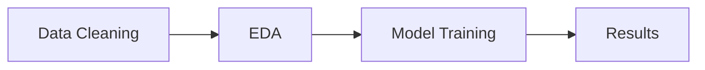
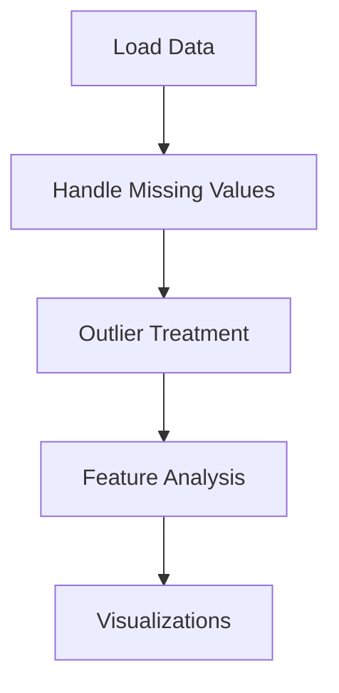
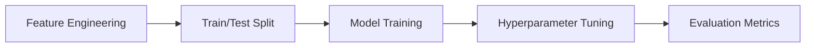

# Data Analytics Projects


A curated repository of modular data analytics and machine learning projects. Each project is self-contained and follows a clean pipeline structure—from data ingestion and EDA to model evaluation and deployment.

---

## Included Projects
| Project              | Domain              | Description                                        | Launch                                                                                                                                   |
| -------------------- | ------------------- | -------------------------------------------------- | ---------------------------------------------------------------------------------------------------------------------------------------- |
| **Titanic**          | ML Playground       | Survival prediction from structured passenger data | [🔗 Colab](https://colab.research.google.com/github/FabriceGhislain7/data_analyst_scientist/blob/main/titanic_project_python/main.ipynb) |
| **Finance**          | Finance & Markets   | Financial forecasting and trend detection          | Coming Soon                                                                                                                              |
| **Retail**           | Business Analytics  | Sales pattern, inventory demand forecasting        | Coming Soon                                                                                                                              |
| **Climate**          | Climate Science     | Temperature trends, anomaly predictions            | Coming Soon                                                                                                                              |
| **Food & Nutrition** | Health/Nutrition    | Dietary pattern recognition, food accessibility    | Coming Soon                                                                                                                              |
| **Energy**           | Energy & Utilities  | Renewable forecasting, load prediction             | Coming Soon                                                                                                                              |
| **Sustainability**   | ESG & Green Metrics | Carbon footprint tracking, sustainable development | Coming Soon                                                                                                                              |
| **Gas & Oil**        | Energy Sector       | Consumption, pricing models, and anomaly detection | Coming Soon                                                                                                                              |
| **Transport**        | Urban Mobility      | Traffic modeling, route optimization               | Coming Soon                                                                                                                              |
| **Scarcity**         | Socioeconomic Data  | Water/food scarcity, poverty impact analysis       | Coming Soon                                                                                                                              |

---

## Core Structure

Each project generally includes the following:

* **Data Wrangling**: Cleaning, type handling, missing value imputation
* **EDA**: Grouped statistics, outlier treatment, visual insights
* **ML Workflow**: Train/test split, feature engineering, model tuning
* **Visualization & Evaluation**: Confusion matrix, ROC, SHAP
* **Optional Deployment**: Streamlit or Gradio demos

---

## Global Workflow



### 🔍 EDA Flow



### ML Workflow



---

## 🗂️ Project Directory

```
data-analytics-projects/
├── titanic_project/            # Titanic survival analysis
│   ├── main.ipynb
│   └── requirements.txt
├── finance_project/            # (Coming Soon)
├── retail_project/             # (Coming Soon)
├── climate_project/            # (Coming Soon)
├── docs/                       # Documentation
├── README.md
└── LICENSE
```

---

## Getting Started

```bash
# Clone the repository
git clone https://github.com/FabriceGhislain7/data-analytics-projects.git

# Navigate into any sub-project
cd data-analytics-projects/titanic_project

# Install dependencies
pip install -r requirements.txt

# Launch the notebook
jupyter notebook main.ipynb
```

---

## Contributing

We welcome contributions for:

* New project additions
* Bug fixes
* Improved documentation
* Feature enhancements

> See [`CONTRIBUTING.md`](docs/CONTRIBUTING.md) and the [Roadmap](docs/ROADMAP.md)

---

## License

This repository is licensed under the MIT License. See [`LICENSE`](LICENSE) for full details.

---

## Contact

| Name                   | Email                                                     |
| ---------------------- | --------------------------------------------------------- |
| Fabrice Ghislain TEBOU | [ghislaintebou@gmail.com](mailto:ghislaintebou@gmail.com) |

For security or urgent issues, please prefix your subject line with `[URGENT]`.
