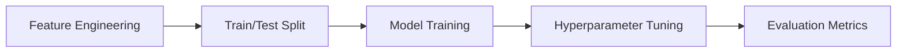

# Titanic Survival Prediction Project

[](https://colab.research.google.com/github/FabriceGhislain7/data_analyst_scientist/blob/main/titanic_project_python/main.ipynb)  


---

## Table of Contents
- [Project Overview](#project-overview)
- [Quick Start](#quick-start)
- [Detailed Setup Guide](#detailed-setup-guide)
- [Key Features](#key-features)
- [Dataset](#dataset)
- [Roadmap](#roadmap)
- [Troubleshooting](#troubleshooting)
- [How to Contribute](#how-to-contribute)
- [License](#license)
---

## Project Overview

A complete **machine learning pipeline** for predicting survival outcomes on the Titanic using structured data. Ideal for data science learners and professionals to practice:

- Exploratory Data Analysis (EDA)
- Feature Engineering
- Model Building & Evaluation

**Tech Stack**:


---

## Quick Start

> **Option 1 – Run in Colab:** Click the badge above
> **Option 2 – Run Locally:**

```bash
# Clone the repository
git clone https://github.com/FabriceGhislain7/data-analytics-projects.git
````

```bash
# Navigate to the project folder
cd data_analyst_scientist/titanic_project
```

```bash
# Install required packages
pip install -r requirements.txt
```

```bash
# Launch the notebook
jupyter notebook main.ipynb
```

---

## Detailed Setup Guide

### Prerequisites

* Python 3.11.8
* Git
* Jupyter Notebook or Lab

---

### Step-by-Step Setup

```bash
# Step 1: Clone the repository
git clone https://github.com/FabriceGhislain7/data-analytics-projects.git
```

```bash
# Step 2: Navigate to the project directory
cd data-analytics-projects\titanic_project
```

```bash
# Step 3: Create a virtual environment
python -m venv venv
```

```bash
# Step 4 (Windows): Activate the virtual environment
.\venv\Scripts\activate
```

```bash
# Step 4 (Mac/Linux): Activate the virtual environment
source venv/bin/activate
```

```bash
# Step 5: Install dependencies
pip install -r requirements.txt
```

```bash
# Step 6: Run the notebook
jupyter notebook main.ipynb
```

---

Here’s your updated section with the **two sub-flowcharts** integrated — one for **EDA** using `graph TD`, and one for **ML workflow** using `graph LR`. This keeps everything structured and visually clear, as you requested:

---

## Key Features

### Workflow Overview

```mermaid
graph LR
  A[Data Cleaning] --> B[EDA]
  B --> C[Model Training]
  C --> D[Results]
````

---

### Exploratory Data Analysis (EDA)

```mermaid
graph TD
  A[Load Data] --> B[Handle Missing Values]
  B --> C[Outlier Treatment]
  C --> D[Feature Analysis]
  D --> E[Visualizations]
```

* Handling missing values and outliers
* Descriptive statistics and grouped insights
* Visualizations using Seaborn & Matplotlib

---

### Machine Learning Workflow



* Feature scaling & encoding
* GridSearchCV for hyperparameter tuning
* ROC curve, Confusion Matrix, Cross-Validation
* Model performance metrics *(to be completed)*

## Dataset

**Source**: [Kaggle Titanic Dataset](https://www.kaggle.com/c/titanic/data)
You’ll work with features like:

| Variable    | Definition                                       | Notes                                           |
|-------------|--------------------------------------------------|-------------------------------------------------|
| `Survived`  | Survival (0 = No, 1 = Yes)                       | Target variable                                 |
| `Pclass`    | Ticket class (1 = 1st, 2 = 2nd, 3 = 3rd)         | Proxy for socio-economic status                 |
| `Sex`       | Gender                                           |                                                 |
| `Age`       | Age in years                                     | Fractional if < 1, `.5` if estimated            |
| `SibSp`     | # of siblings/spouses aboard                     | Sibling = brother, sister, step-, Spouse = married |
| `Parch`     | # of parents/children aboard                     | Parent = mother/father, Child = daughter/son    |
| `Ticket`    | Ticket number                                    |                                                 |
| `Fare`      | Passenger fare                                   |                                                 |
| `Cabin`     | Cabin number                                     |                                                 |
| `Embarked`  | Port of Embarkation (C = Cherbourg, Q = Queenstown, S = Southampton) |         |


---

## Roadmap

* [x] Data cleaning and preprocessing
* [x] EDA and visualization
* [ ] Machine learning models
* [ ] Feature engineering using domain knowledge
* [ ] Streamlit/Gradio deployment
* [ ] Unit tests for model pipeline

---

## Troubleshooting

| Issue                   | Solution |
| ----------------------- | -------- |
| **ModuleNotFoundError** |          |

```bash
# Activate environment and reinstall
source venv/bin/activate  # OR .\venv\Scripts\activate
pip install -r requirements.txt
```

\| **Jupyter kernel not showing** |

```bash
python -m ipykernel install --user --name=venv
```

\| **Python not recognized** |
Ensure Python 3.11.8 is installed and added to system PATH.

---

## How to Contribute

1. Fork the repository
2. Create your feature branch:

```bash
git checkout -b feature-name
```

3. Commit your changes:

```bash
git commit -m "Add feature"
```

4. Push to GitHub:

```bash
git push origin feature-name
```

5. Open a Pull Request


